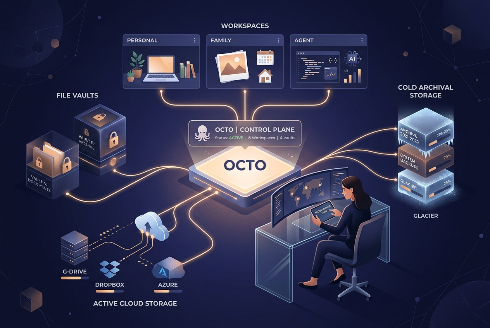

# Octo

Octo is a self-hosted control plane for people who want **one place to reach their workspaces, files, applications, and agents** without rebuilding login and storage plumbing for every project.



---

## Why this exists

Personal files, family media, work projects, research systems, and AI agents often end up scattered across local disks and unrelated services. Octo gives them one durable identity and workspace boundary while keeping the underlying infrastructure replaceable.

- **PostgreSQL / Supabase**: Canonical metadata, workspace membership, and fail-closed Row-Level Security (RLS).
- **Cloudflare R2**: Fast, low-cost active object storage for hot files.
- **Google Drive**: Scalable personal cold storage (utilizing your Google One / AI Pro 5TB pooled quota) for archived media.
- **One Platform API & Scoped Agent Keys**: Users and autonomous coding agents interact with logical file IDs and workspace machine tokens. Master database and cloud credentials stay on the server. A workspace's provisioned database can be reached two ways: its own connection string, returned once to the caller that created it, or the SQL surface (`POST /api/workspaces/<id>/query`), where an API key alone runs SQL with no connection string — either way it reaches no Octo control-plane data.

> **Building a project that Octo serves?** Octo is that project's data layer. Do not
> stand up a database of your own — provision the workspace database through Octo, then
> run SQL with your Octo API key or connect with an ordinary Postgres client. A human
> mints the project's workspace-scoped key once (creating a workspace and minting a key
> are human-stamped; an API key can never do either). See
> **[docs/consuming-octo.md](docs/consuming-octo.md)**.

---

## Shipped slices & live architecture

```
Google Login & RLS ──► Full-Stack Server & UI ──► Active R2 Storage ──► Drive Archival ──► Agent API Keys
    (Slice 1 - Merged)     (Full-Stack - Merged)     (Slice 2 - Merged)   (Slice 5 - Verified)   (Slice 7 - Merged)
```

| Slice / Component | Scope & Capabilities | Status |
|---|---|---|
| **Slice 1 (#3)** | Google OAuth login, Octo principals, workspaces, PostgreSQL RLS, control dashboard | **Merged** (`PR #20`) |
| **Slice 2 (#4)** | Canonical `octo.files` catalog, signed URL generation, Cloudflare R2 active storage | **Merged** (`PR #21`) |
| **Slice 7 (#9)** | Scoped machine identities, workspace API keys (`OCTO_API_KEY`), and REST API gateway | **Merged** (`PR #21`) |
| **Full-Stack Runtime** | Node server (`src/server/`), Vite frontend (`src/main.ts`), live DB & R2 integration | **Merged** (`PR #22`) |
| **QA Vision Pipeline** | Playwright E2E testing with Alibaba Qwen 3.8 Flash multimodal vision model verification | **Merged** (`PR #23`) |
| **Provider Runtime (#16)** | Provider configuration for R2 & Google Drive OAuth without secret leakage in Git | **Merged** (`PR #19`) |
| **Slice 5 (#7)** | Google Drive 5TB cold storage archival transition and on-demand restore | **Verified Live** |
| **Slice 20 (#153)** | A real, independently connectable PostgreSQL database per workspace, owned by its own scoped role | **Merged** (`PR #155`) |
| **Slice 21** | Run SQL against a workspace's own provisioned database with just an Octo API key — no connection string, host, or port | **Merged** |
| **Slice 3 (#5)** | Workspace image/video gallery with thumbnails and album browsing | *Next up* |

---

## Live multi-tier verification

Octo includes live verification pipelines testing isolated workspaces across both storage tiers:

```bash
# Verify configured credentials and live quotas (R2 buckets + Google Drive 5TB)
python scripts/verify_storage_credentials.py

# Run live multi-workspace upload, archive, and restore cycle
python scripts/verify_live_guest_storage.py
```

### Verified workflow:
1. **Multi-Workspace Ingestion**: Guest accounts authenticate and upload active files to Cloudflare R2 via the platform API.
2. **SHA-256 Integrity**: Downloads confirm bit-for-bit integrity against PostgreSQL metadata.
3. **Archival Transition**: Active file transitions to Google Drive cold storage; verified in Google Drive; active R2 copy pruned.
4. **On-Demand Restore**: Archived object restored from Google Drive back to Cloudflare R2 with exact byte match.
5. **Fail-Closed Isolation**: Cross-workspace path and database access are strictly denied.

---

## Architecture & boundaries

- **Single owner, multiple isolated workspaces**: Each family member, collaborator, or agent operates in their own workspace boundary.
- **Zero master credentials in browsers or agents**: Browsers and client SDKs only receive short-lived signed URLs, server-proxied streams, or scoped workspace machine tokens.
- **Provider-level encryption**: Files are encrypted in transit via TLS 1.3 and at rest via AES-256 by Cloudflare and Google.
- **No unnecessary abstractions**: Uses platform defaults from Supabase, Cloudflare, and Google without adding speculative infrastructure or custom secret brokers.

---

## Managed folder backup

Back up your **Desktop** and **Downloads** folders into one workspace, foldered by
source and incremental on re-run. It never touches your local files and stores no
credentials. See **[docs/backup.md](docs/backup.md)** for the three-step start
(get a key, set two variables, run), configuration, and a daily schedule.

```bash
npm run backup -- --dry-run   # preview what would upload
npm run backup -- --commit    # upload changed files
```

---

## Repository operational capture

Point a workspace at this repository to collect operational snapshots — git
state, repository shape, test inventory, and live server health — as JSON files
you can browse and analyze alongside other workspace data. Read-only against the
repo and server; the only write is the snapshot upload.

```bash
OCTO_OPS_TOKEN=octo_live_ws_... OCTO_OPS_WORKSPACE=<uuid> npm run capture-ops
OCTO_OPS_TOKEN=... OCTO_OPS_WORKSPACE=... npm run capture-ops -- --dry-run
```

---

## Local development & gates

```bash
# Install dependencies
npm install

# Run TypeScript type check
npm run typecheck

# Run unit and integration tests
npm test

# Run contract integrity and schema tests
python scripts/check_json.py
python -m unittest discover -s tests -v

# Run linter and static typing
ruff check scripts tests
ruff format --check scripts tests
mypy
```
