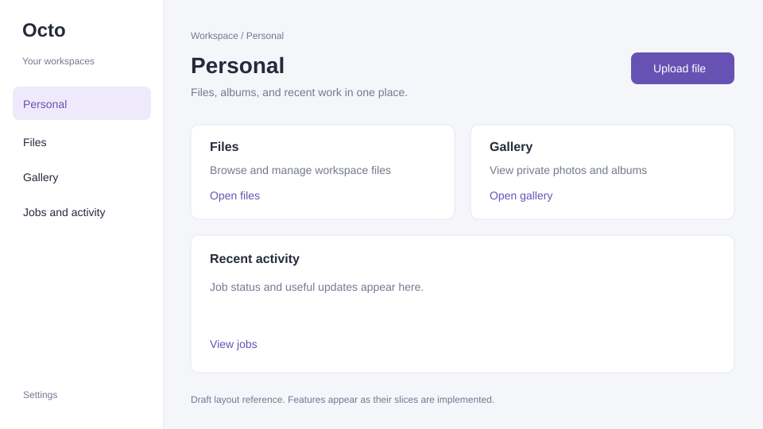

# Octo UI direction

The owner requests a simple, aesthetic control dashboard (#3), workspace gallery (#5), and operations page (#8).
Use a maintained template or standard MUI components with minimal customization.
Share one small theme for spacing, typography, color, and component defaults.
Supabase and provider consoles handle deeper infrastructure administration; link them where useful.

## Views

| View | Required experience |
| --- | --- |
| Control dashboard | Google login, authorized workspace selection, clear entry into the selected workspace |
| Workspace gallery | Album grid, thumbnails, image viewer, browser-supported video, responsive layout |
| Operations | Job state, retry count, useful error summary, relevant activity and retry action |

Keep configuration and standard components ahead of custom CSS or a bespoke design system.
Implement Octo-specific data and interactions only as their slice requires them.
Do not add charts, role panels, or infrastructure controls without a current user need.

## CGM guidance

Reviewed CGM 0.5.7 at `c069613ca8b3e02bcf5aba1960160583537f8a3a`:
- [HSW](https://github.com/Pukujan/content-generation-modules/blob/c069613ca8b3e02bcf5aba1960160583537f8a3a/docs/HUMAN_SOUNDING_WRITING.md): plain concrete copy, useful labels, restrained charts.
- [HTML demo](https://github.com/Pukujan/content-generation-modules/blob/c069613ca8b3e02bcf5aba1960160583537f8a3a/modules/html-demo/SKILL.md): reuse project tokens, visible focus, keyboard controls, useful alt text, mobile/tablet/desktop checks.
- [Visual direction](https://github.com/Pukujan/content-generation-modules/blob/c069613ca8b3e02bcf5aba1960160583537f8a3a/modules/visual-direction/SKILL.md): clear focal point, negative space, restrained visual density.

HSW governs writing. It does not prescribe MUI or a dashboard layout.
The owner-directed Octo template/component approach controls the product UI.

## Draft layout reference

This sketch records the requested light visual treatment. It is not a working product screen or evidence that files/gallery/jobs have shipped. Implement those views using the selected template/components as their slices are built.
